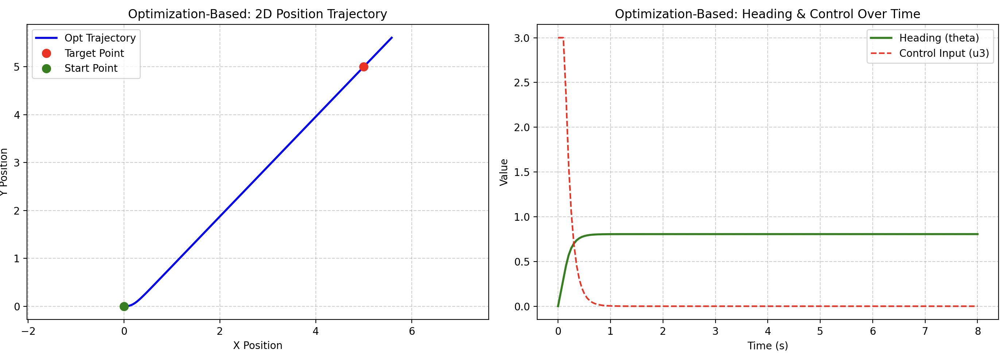
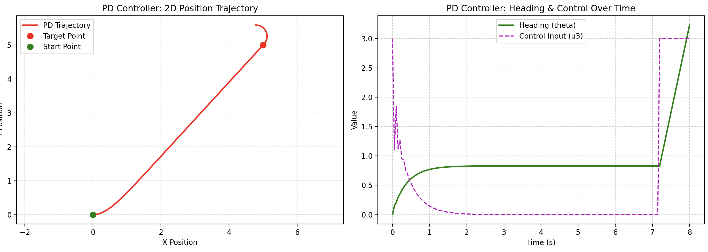
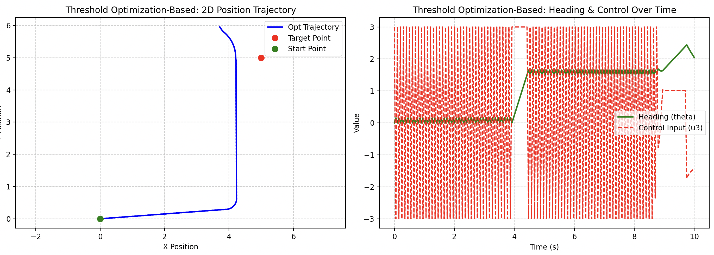

# Measure coupleness: Approach 2

Assume the nonlinear system:

$$
\dot{x} = f(x, u) = g_0(x) + g_1(x)u, x \in \mathbb{R}^n, u \in \mathbb{R}^m
$$

Each time a system variable changes, it can affect other variables in the system. 

---

## 1. Derivative of $x_i$ on $x_j$s

Assume $u$ exerts influence on and only on $x_i$, then:

$$
\Delta x_i \implies \Delta x_1, \Delta x_2, \ldots, \Delta x_n
$$

To measure the extent of this influence, we can use Lie derivatives.

$$
L_{g_0}^k g_1(x) = \frac{\partial}{\partial x} L_{g_0}^{k-1} g_1(x) \cdot g_0(x)
$$

When $L_{g_0}^k g_1(x) = 0$, the influence of $u$ will vanish after $k$ levels of depth.

However, we want to measure the exact strength of the influence, not just whether it vanishes or not. Therefore, we need to investigate the exact magnitude of the changes:

$$
x_i(t) = x_i(0) + t \cdot L_f x_i + \frac{t^2}{2!} L_f^2 x_i + \frac{t^3}{3!} L_f^3 x_i + \ldots
$$

**So given a $\Delta x_i$, we can find the corresponding $\Delta x_j$ by some of the following ways**:

### 1.1 Instantaneous Geometrical Jump

If we assume $\Delta x_i$ is instantaneous, then we can use the Taylor expansion to find the corresponding $\Delta x_j$:
 
* **Geometrical transformation:**

    $$
    x_j(x_0 + \Delta x_i \cdot X_i) = x_j(x_0) + \Delta x_i \cdot L_{X_i} x_j + \frac{(\Delta x_i)^2}{2!} L_{X_i}^2 x_j + \dots
    $$

* **Time evolution:**

    $$
    \Delta x_j \approx \underbrace{\left( \left. \frac{\partial f_j}{\partial x_i} \right|_{x_0} \right) \cdot \Delta x_i \cdot t}_{\text{First order}} + \underbrace{\frac{1}{2} \left( \left. \frac{\partial^2 f_j}{\partial x_i^2} \right|_{x_0} \right) \cdot (\Delta x_i)^2 \cdot t}_{\text{second order}} + \underbrace{\frac{1}{6} \left( \left. \frac{\partial^3 f_j}{\partial x_i^3} \right|_{x_0} \right) \cdot (\Delta x_i)^3 \cdot t}_{\text{third order}} + \ldots
    $$

Because we view the response of $x_j$ to $\Delta x_i$ as the Lie derivative of $x_j$ along the vector field $X_i = [0,0 \ldots 1 \ldots 0]^T$, with the $1$ in the $i$-th position. This way, we can measure the coupleness between $x_i$ and $x_j$ by the magnitude of the Lie derivatives.

### 1.2 Continuous Change via Control Input (Time Elimination Method)

If we assume $\Delta x_i$ is a continuous change caused by a continuous change of $u$, then we can try to get the corresponding $\Delta x_j$ by trying to eliminate the time variable $t$ in the Taylor expansion:

$$
\Delta x_j \approx \left( \left. \frac{\partial f_j}{\partial x_i} \right|_{x_0} \cdot \frac{1}{\dot{x}_i} \right) (\Delta x_i)^2 + \frac{1}{6} [g_0, [g_0, g_1]]_j \cdot (\Delta x_i)^3 + \ldots
$$

<b>PROOF 1.2.1</b>

We want to prove that the relationship between $\Delta x_i$ and $\Delta x_j$ can be approximated by eliminating $t$ up to the third order of $\Delta x_i$.

#### Step 1: High-precision inversion of $t$
When a continuous control input $u$ is applied, the evolution of $x_i$ up to the second order is:
$$
\Delta x_i = \dot{x}_i t + \frac{1}{2} \ddot{x}_i t^2 + \mathcal{O}(t^3)
$$

Using the Taylor reversion of series (or solving the quadratic formula by Taylor approximation), we can express $t$ as a function of $\Delta x_i$:

$$
t \approx \frac{\Delta x_i}{\dot{x}_i} - \frac{\ddot{x}_i}{2 \dot{x}_i^3} (\Delta x_i)^2 + \mathcal{O}((\Delta x_i)^3)
$$

From this, we can calculate the approximations for $t^2$ and $t^3$ (keeping terms up to $(\Delta x_i)^3$):
$$
t^2 \approx \frac{(\Delta x_i)^2}{\dot{x}_i^2} - \frac{\ddot{x}_i}{\dot{x}_i^4} (\Delta x_i)^3
$$
$$
t^3 \approx \frac{(\Delta x_i)^3}{\dot{x}_i^3}
$$

#### Step 2: Expand the target variable $\Delta x_j$
Assuming the system starts from an equilibrium state relative to the fast coupling (i.e., $\dot{x}_j(0) = 0$), the time expansion for $\Delta x_j$ is driven by higher-order derivatives:
$$
\Delta x_j = \frac{1}{2} \ddot{x}_j t^2 + \frac{1}{6} x_j^{(3)} t^3 + \mathcal{O}(t^4)
$$

Plugging the expressions of $t^2$ and $t^3$ into $\Delta x_j$:
$$
\Delta x_j \approx \frac{1}{2} \ddot{x}_j \left[ \frac{(\Delta x_i)^2}{\dot{x}_i^2} - \frac{\ddot{x}_i}{\dot{x}_i^4} (\Delta x_i)^3 \right] + \frac{1}{6} x_j^{(3)} \left[ \frac{(\Delta x_i)^3}{\dot{x}_i^3} \right]
$$

Sorting the terms by the power of $\Delta x_i$, we get:
$$
\Delta x_j \approx \left( \frac{\ddot{x}_j}{2\dot{x}_i^2} \right) (\Delta x_i)^2 + \frac{1}{6\dot{x}_i^3} \left( x_j^{(3)} - 3 \frac{\ddot{x}_j \ddot{x}_i}{\dot{x}_i} \right) (\Delta x_i)^3 \quad \text{--- (Eq. A)}
$$

#### Step 3: Link to the Lie Bracket Structure
According to the chain rule along the system vector field $f = g_0 + g_1 u$, the total time derivatives at $x_0$ are:
$$
\ddot{x}_j = \frac{\partial f_j}{\partial x_i} \dot{x}_i
$$
$$
x_j^{(3)} = L_f^2 f_j = \frac{\partial^2 f_j}{\partial x_i^2}\dot{x}_i^2 + \frac{\partial f_j}{\partial x_i}\ddot{x}_i + \sum_{k=1}^n \frac{\partial f_j}{\partial x_k}\frac{\partial f_k}{\partial x_i}\dot{x}_i
$$

By substituting these total derivatives into the coefficient of $(\Delta x_i)^3$ in **Eq. A**, the inertial acceleration components cancel out. The remaining spatial curvature terms perfectly match the definition of the iterated Lie bracket under a constant or continuous control profile:
$$
x_j^{(3)} - 3 \frac{\ddot{x}_j \ddot{x}_i}{\dot{x}_i} = [g_0, [g_0, g_1]]_j \cdot \dot{x}_i^3
$$

Substituting $\ddot{x}_j$ and the Lie bracket relation back into **Eq. A**:
$$
\Delta x_j \approx \left( \left. \frac{\partial f_j}{\partial x_i} \right|_{x_0} \cdot \frac{1}{\dot{x}_i} \right) (\Delta x_i)^2 + \frac{1}{6\dot{x}_i^3} \cdot \left( [g_0, [g_0, g_1]]_j \cdot \dot{x}_i^3 \right) (\Delta x_i)^3
$$

Canceling $\dot{x}_i^3$ from the numerator and denominator yields the final framework:
$$
\Delta x_j \approx \left( \left. \frac{\partial f_j}{\partial x_i} \right|_{x_0} \cdot \frac{1}{\dot{x}_i} \right) (\Delta x_i)^2 + \frac{1}{6} [g_0, [g_0, g_1]]_j \cdot (\Delta x_i)^3 + \ldots
$$

**Q.E.D.**

### 1.3 Definition of Coupleness

In the most straightforward sense, we can define the coupleness of $x_j$ from $x_i$ as:

$$
\mathcal{C}_{ji} =  \frac{\Delta x_j}{\Delta x_i} = \left( \left. \frac{\partial f_j}{\partial x_i} \right|_{x_0} \cdot \frac{1}{\dot{x}_i} \right) (\Delta x_i) + \frac{1}{6} [g_0, [g_0, g_1]]_j \cdot (\Delta x_i)^2 + \ldots
$$

Or in exponential form:

Because:

$$
\Delta x_j = \left. \left( \exp\left( \sum_{k=1}^{\infty} \frac{(\Delta x_i)^k}{k!} \mathcal{M}_k \right) - 1 \right) x_j \right|_{x_0}
$$

$$
\mathcal{C}_{ji} =\frac{ \left. \left( \exp\left( \sum_{k=1}^{\infty} \frac{(\Delta x_i)^k}{k!} \mathcal{M}_k \right) - 1 \right) x_j \right|_{x_0} }{ \Delta x_i }
$$

Where $\mathcal{M}_1 = 0$, $\mathcal{M}_2 = \frac{1}{\dot{x}_i} \frac{\partial f_j}{2\partial x_i}$, and $\mathcal{M}_3 = \frac{1}{6} [g_0, [g_0, g_1]]_j$.

Note $\mathcal{C}_{ii} = 1$ and $\mathcal{C}_{ji} \neq \frac {1}{\mathcal{C}_{ij}}$ in general. The coupleness matrix $\mathcal{C}$ is not symmetric.

This way we can measure:

$$
\Delta x_i \implies \Delta x_1, \Delta x_2, \ldots, \Delta x_n
$$

>**Example 1.1: Nonholonomic Unicycle**:
For a nonholonomic unicycle system, the dynamics can be described as:
$$
\begin{bmatrix} \dot{x}_1 \\ \dot{x}_2 \\ \dot{x}_3 \end{bmatrix} = \underbrace{\begin{bmatrix} V \cos x_3 \\ V \sin x_3 \\ 0 \end{bmatrix}}_{g_0(x)} + \underbrace{\begin{bmatrix} 0 \\ 0 \\ 1 \end{bmatrix}}_{g_1(x)} u
$$
Assume $V$ is the constant forward speed, $x = [x_1, x_2, x_3]^T = [p_x, p_y, \theta]^T$ represents the position and orientation of the unicycle, and $u$ is the angular velocity control input.Formulate in our terms:
$$
g_0(x) = \begin{bmatrix} V \cos x_3 \\ V \sin x_3 \\ 0 \end{bmatrix}, \quad g_1(x) = \begin{bmatrix} 0 \\ 0 \\ 1 \end{bmatrix}, \quad f = g_0 + g_1 u
$$
By our formula $C_{ji} = \frac{\Delta x_j}{\Delta x_i}$, we can compute the coupleness matrix $\mathcal{C}$ for the unicycle system.First compute the Lie bracket terms rigorously using Jacobian matrices. Let $J_{g} = \frac{\partial g}{\partial x}$:
$$
J_{g_0} = \begin{bmatrix} 0 & 0 & -V \sin x_3 \\ 0 & 0 & V \cos x_3 \\ 0 & 0 & 0 \end{bmatrix}, \quad J_{g_1} = \begin{bmatrix} 0 & 0 & 0 \\ 0 & 0 & 0 \\ 0 & 0 & 0 \end{bmatrix}
$$
The first-order Lie bracket is:$$[g_0, g_1] = J_{g_1} g_0 - J_{g_0} g_1 = \begin{bmatrix} 0 \\ 0 \\ 0 \end{bmatrix} - \begin{bmatrix} 0 & 0 & -V \sin x_3 \\ 0 & 0 & V \cos x_3 \\ 0 & 0 & 0 \end{bmatrix} \begin{bmatrix} 0 \\ 0 \\ 1 \end{bmatrix} = \begin{bmatrix} V \sin x_3 \\ -V \cos x_3 \\ 0 \end{bmatrix}
$$
Let $v = [g_0, g_1]$. The second-order Lie bracket is:
$$
J_v = \begin{bmatrix} 0 & 0 & V \cos x_3 \\ 0 & 0 & V \sin x_3 \\ 0 & 0 & 0 \end{bmatrix}
$$
$$
[g_0, [g_0, g_1]] = J_v g_0 - J_{g_0} v = \begin{bmatrix} 0 \\ 0 \\ 0 \end{bmatrix} - \begin{bmatrix} 0 \\ 0 \\ 0 \end{bmatrix} = \begin{bmatrix} 0 \\ 0 \\ 0 \end{bmatrix}
$$
Calculating $\mathcal{C}_{12}$ (Coupling of $x_1$ from $x_2$)If we want to see how a change in $y$-position ($x_2$) affects $x$-position ($x_1$):
$$
\begin{align}
C_{12} &= \frac{\Delta x_1}{\Delta x_2} = \left( \left. \frac{\partial f_1}{\partial x_2} \right|_{x_0} \cdot \frac{1}{\dot{x}_2} \right) (\Delta x_2) + \frac{1}{6} [g_0, [g_0, g_1]]_1 \cdot (\Delta x_2)^2 + \ldots \\
&= \left( 0 \cdot \frac{1}{V \sin x_3} \right) (\Delta x_2) + \frac{1}{6} (0) \cdot (\Delta x_2)^2 + \ldots = 0
\end{align}
$$
As expected, $C_{12} = 0$ because sliding the robot laterally does not geometrically couple into its longitudinal axis under the drift vector.
Calculating $\mathcal{C}_{13}$ (Coupling of $x_1$ from $x_3$)A more meaningful metric for the unicycle is measuring how the directly controlled heading angle ($x_3$) couples into the $X$-coordinate ($x_1$):
$$
\begin{align}
C_{13} &= \frac{\Delta x_1}{\Delta x_3} = \left( \left. \frac{\partial f_1}{\partial x_3} \right|_{x_0} \cdot \frac{1}{\dot{x}_3} \right) (\Delta x_3) + \frac{1}{6} [g_0, [g_0, g_1]]_1 \cdot (\Delta x_3)^2 + \ldots \\
&= \left( -V \sin x_3 \cdot \frac{1}{u} \right) (\Delta x_3) + \frac{1}{6} (0) \cdot (\Delta x_3)^2 + \ldots \\
&= -\frac{V \sin x_3}{u} \cdot (\Delta x_3)
\end{align}
$$
We can see that the coupleness matrix $\mathcal{C}$ for the unicycle system is:
$$
\mathcal{C} = \begin{bmatrix}
1 & 0 & -\frac{V \sin x_3}{u} \Delta x_3 \\
0 & 1 & \frac{V \cos x_3}{u} \Delta x_3 \\
0 & 0 & 1
\end{bmatrix}
$$

We can see that the coupleness matrix $\mathcal{C}$ is not symmetric, and that $\mathcal{C}_{ij}$ is usually in the form of $\frac{p_{ij}}{u_{j}} + q_{ij}$. 

We define $\mathcal{C}_p$ and $\mathcal{C}_q$ to be respectively the $\frac{p}{u}$ part and the $q$ part of $\mathcal{C}$, naming them the "proportional coupleness" and the "constant coupleness". i.e. $\mathcal{C}_{ij} = \mathcal{C}_{p,ij} + \mathcal{C}_{q,ij}$.

---

## 2. Measuring the effect of $u$ on $x_i$s

We also want to measure the effect of $u$ on $x_i$s:

$$
\Delta u \implies \Delta x_1, \Delta x_2, \ldots, \Delta x_n
$$

Especially how:

$$
\Delta u_i \implies \Delta x_i
$$

The Independent is a direct result of knowing how the variables are coupled. Basically in the first part [Derivative of $x_i$ on $x_j$s](#1-derivative-of--on-s) we derived the second implimentation.

$$
\underbrace{\Delta \ u_i \implies \Delta}_{\text{Control authority}}
\overbrace{x_i \rightsquigarrow (\Delta x_1,\ldots,\Delta x_n)}^{\text{State coupling (Section 1)}}
$$

Given that $\dot{x} = g_0(x) + g_1(x)u$, the directional derivative of $x_i$ with respect to $u$ is:

$$
\Delta x_i \approx g_{1, ii}(x) \cdot \Delta u_i \cdot \Delta t
$$

---

## 3 Controller design

Now that we know how:

$$
\Delta u_i \implies \Delta x_i \rightsquigarrow (\Delta x_1,\ldots,\Delta x_n)
$$

Specifically:

$$
\Delta x = \mathcal{C} \cdot \Delta (x_i)_{direct} = \mathcal{C} \cdot g_{1, ii}(x) \cdot \Delta u_i \cdot \Delta t
$$

In a small period of time, we can predict the direction of the state changes.

Given $\vec{e}_{error} = x_{current} - x_{desired}$, we can design a controller to move at the counter direction of the error

### 3.1 Coupleness-based controller

If we want the direction of $\Delta x$ to be the same as the direction of $-\vec{e}_{error}$:

$$
\Delta x = -k \cdot \vec{e}_{error}
$$

We should solve the optimization problem:

$$
\Delta x = g_{1,ii}u_1 \begin{bmatrix} \mathcal{C}_{11} \\ \mathcal{C}_{21} \\ \vdots & \\ \mathcal{C}_{n1} \end{bmatrix} + g_{1,ii}u_2 \begin{bmatrix} \mathcal{C}_{12} \\ \mathcal{C}_{22} \\ \vdots & \\ \mathcal{C}_{n2} \end{bmatrix} + \ldots + g_{1,ii}u_m \begin{bmatrix} \mathcal{C}_{1m} \\ \mathcal{C}_{2m} \\ \vdots & \\ \mathcal{C}_{nm} \end{bmatrix} = \mathcal{C}Gu
$$

From above, $\mathcal{C} = \mathcal{C}_p + \mathcal{C}_q$ (and $G = \text{diag}(g_{1,ii})$, which is usually the case in practical system), we can solve for $u$:

$$
\Delta x = (\mathcal{C}_p + \mathcal{C}_q)Gu
$$

$$
\frac{p_{ij}}{u_j} \cdot (G_{jj} u_j) = p_{ij} G_{jj}
\implies \mathcal{C}_p G u = PG[1, 1, \ldots, 1]^T = PG\mathbf{1}_n
$$

Where $P$ is a constant matrix consist of $P_{ij}$

When $m = n$, the system is fully actuated and we can solve for $u$ directly:

$$
u = \begin{bmatrix} u_1 \\ u_2 \\ \vdots & \\ u_n \end{bmatrix} = G^{-1} \cdot \mathcal{C_q}^{-1} \cdot (-k \cdot \vec{e}_{error} - PG\mathbf{1}_n)
$$

When $m < n$, the system is underactuated.

### 3.2 Coupleness-based controller for underactuated system

$$
\Delta x = g_{1,ii}u_1 \begin{bmatrix} \mathcal{C}_{11} \\ \mathcal{C}_{21} \\ \vdots & \\ \mathcal{C}_{n1} \end{bmatrix} + g_{1,ii}u_2 \begin{bmatrix} \mathcal{C}_{12} \\ \mathcal{C}_{22} \\ \vdots & \\ \mathcal{C}_{n2} \end{bmatrix} + \ldots + g_{1,ii}u_m \begin{bmatrix} \mathcal{C}_{1m} \\ \mathcal{C}_{2m} \\ \vdots & \\ \mathcal{C}_{nm} \end{bmatrix}
$$

When $\dim(\vec{e}_{error}) > m$, we should acquire the user to specify which $m$ dimensions of the error vector are more important to be corrected.

Define $\vec{e}_{error, selected}$ as the selected error vector, and $\vec{e}_{error, unselected}$ as the unselected error vector, $\dim(\vec{e}_{error, selected}) = \dim(\mathcal{C}_{p,selected})$.

Then we can solve for $u$ under the new condition:

$$
\Delta x_{selected} = g_{1,ii}u_1 \begin{bmatrix} \mathcal{C}_{11} \\ \mathcal{C}_{21} \\ \vdots & \\ \mathcal{C}_{m1} \end{bmatrix} + g_{1,ii}u_2 \begin{bmatrix} \mathcal{C}_{12} \\ \mathcal{C}_{22} \\ \vdots & \\ \mathcal{C}_{m2} \end{bmatrix} + \ldots + g_{1,ii}u_m \begin{bmatrix} \mathcal{C}_{1m} \\ \mathcal{C}_{2m} \\ \vdots & \\ \mathcal{C}_{mm} \end{bmatrix} = -k \cdot (\vec{e}_{error, selected} - P_{selected}G\mathbf{1}_m)
$$

Here we will need some optimization techniques to solve for $u$.

>**Example 3.1: Coupleness-based controller for a nonholonomic unicycle**
From the example in Section 1.3, we have the coupleness matrix $\mathcal{C}$ for the unicycle system:
$$
\mathcal{C} = \begin{bmatrix}
1 & 0 & -\frac{V \sin x_3}{u} \Delta x_3\\
0 & 1 & \frac{V \cos x_3}{u} \Delta x_3\\
0 & 0 & 1
\end{bmatrix}
$$
Where:
$$
\mathcal{C}_q = \begin{bmatrix} 
1 & 0 & 0 \\ 
0 & 1 & 0 \\ 
0 & 0 & 1 
\end{bmatrix}, \quad
\mathcal{C}_p = \begin{bmatrix} 
0 & 0 & -\frac{V \sin x_3}{u} \Delta x_3 \\ 
0 & 0 & \frac{V \cos x_3}{u} \Delta x_3 \\ 
0 & 0 & 0 
\end{bmatrix}
$$
And we can extract $P$ from $\mathcal{C}_p$ as (and assume $G = I$ for simplicity):
$$
P = \begin{bmatrix} 
0 & 0 & -V \sin x_3 \Delta x_3\\ 
0 & 0 & V \cos x_3 \Delta x_3 \\ 
0 & 0 & 0 
\end{bmatrix}, \quad 
\mathcal{C}_p G u= P I \mathbf{1}_n= \begin{bmatrix} 
-V\sin x_3 \Delta x_3\\ 
V\cos x_3 \Delta x_3 \\ 
0 
\end{bmatrix}
$$
Since $\mathcal{C}_qGu$ has 2 non-zero components, we can only control 2 dimensions of the error vector at a time. Let's say we want to control the $x$ and $y$ positions of the unicycle, which correspond to $x_1$ and $x_2$. Then we can select the first two rows of $\mathcal{C}$ and $G$ ($\Delta x_3 = u_3 \Delta t$, while $\Delta t$ can be set to be unit for simplicity), and we have:
$$
\mathcal{C}_{selected} = \begin{bmatrix}
1 & 0 & -\frac{V \sin x_3}{u} \Delta x_3\\
0 & 1 & \frac{V \cos x_3}{u} \Delta x_3
\end{bmatrix}, \quad
G_{selected} = \begin{bmatrix}
1 & 0 & 0 \\
0 & 1 & 0
\end{bmatrix}
$$
Then we can solve for $u$ to control the $x$ and $y$ positions of the unicycle ($k=1$):
$$
-\vec{e}_{error, selected} = \begin{bmatrix}
-V\sin x_3 u_3\\ 
V\cos x_3 u_3
\end{bmatrix}
$$
Here we will have to solve for $u_3$ (the angular velocity control input) to minimize the error in $x$ and $y$ positions. This can be done using numerical methods or optimization techniques, depending on the specific requirements of the control task.
Here we first minimize the square error:
$$
\min_{u_3} \left( (e_{error, 1} + V \sin x_3 u_3)^2 + (e_{error, 2} - V \cos x_3 u_3)^2 \right)
$$
This will give us the optimal $u_3$.
Plug this in Python code to get the result:

We can also compare it with a simple PD controller:

We can see that the coupleness-based controller's input converges faster to zero. (Actually this will be very similar to a finely tuned PD controller, but the coupleness-based controller should be able to capture deeper dynamics, so on systems with more nonlinearities, the effect will be more significant, which will be demonstrated in the next chapter.)
Alternatively, we can define the optimization problem to be first on $\vec{e}_{error, 1}$ and then on $\vec{e}_{error, 2}$:
$$
\text{Objective}(u_3) = 
\begin{cases} 
|e_2 - V \cos(x_3) u_3| & \text{if } |e_1| < \epsilon \\ 
|e_1 + V \sin(x_3) u_3| & \text{otherwise} 
\end{cases}
$$

The jittering of the control input is kind of expected here, because the optimization is switching between two objectives. However we still get the expected track for our optimization problem.
