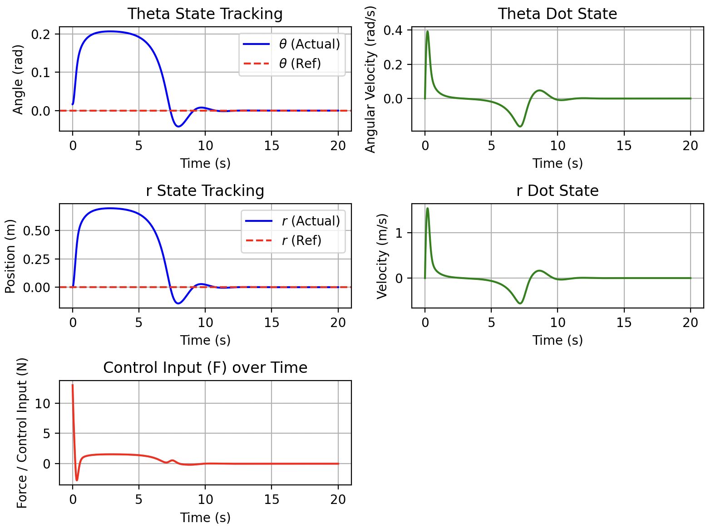
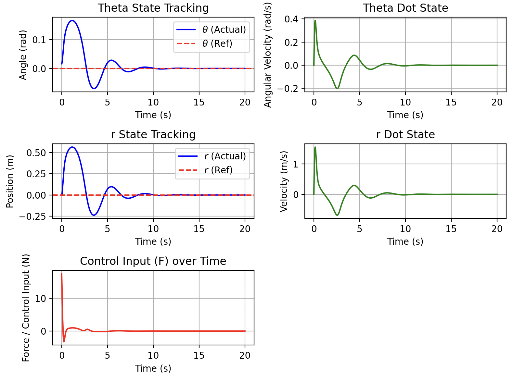
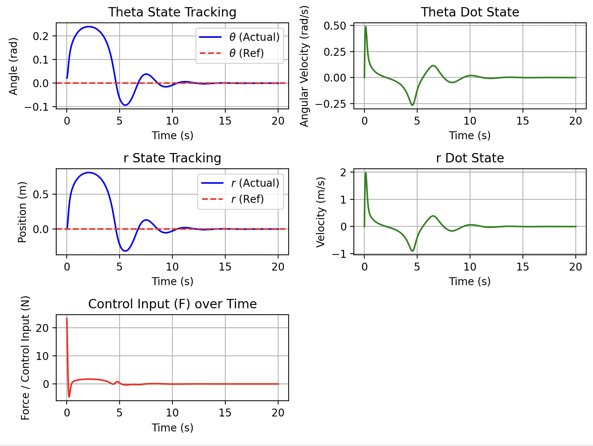

# 4.3 Latitudinal Dynamics of a Unicycle

$$
\begin{bmatrix} 
m_w R^2 + m_{rod} r^2 + m_p (R + h)^2 + (I_w + I_b  + I_{rod}) & 0 \\ 
0 & m_{rod} 
\end{bmatrix}
\begin{bmatrix} 
\dot{u}_1 \\ 
\dot{u}_2 
\end{bmatrix}
= \begin{bmatrix} 
F R - m_{rod} g r \cos\theta + m_w g R \sin\theta + m_p g (R + h) \sin\theta - m_{rod} r (2 u_2 u_1 + R u_1^2) \\ 
F - m_{rod} g \sin\theta + m_{rod} r u_1^2 
\end{bmatrix}
$$

Where $u_1 = \dot{\theta}$ and $u_2 = \dot{r} - R\dot{\theta}$.

In fact we can omit the $m_{rod} r^2$ in the inertia matrix. 

Define:

$$
J = m_w R^2 + m_p (R + h)^2 + (I_w + I_b  + I_{rod}) \\
m = m_{rod} \\
G = m_w g R + m_p g (R + h) \\
$$

Then:

$$
\begin{bmatrix} 
J & 0 \\ 
0 & m
\end{bmatrix}
\begin{bmatrix} 
\dot{u}_1 \\ 
\dot{u}_2 
\end{bmatrix}
= \begin{bmatrix}
F R - m g r \cos\theta + G \sin\theta - m r (2 u_2 u_1 + R u_1^2) \\ 
F - m g \sin\theta + m r u_1^2 
\end{bmatrix}
$$

which can be rewritten as:

$$
\begin{bmatrix} \dot{x}_1 \\ \dot{x}_2 \\ \dot{x}_3 \\ \dot{x}_4 \end{bmatrix} = \begin{bmatrix} x_3 \\ x_4 \\ \frac{1}{J} \left[ G \sin x_1 - m g (x_2 + R x_1) \cos x_1 - m (x_2 + R x_1) (2 x_3 x_4 + R x_3^2) \right] \\ (x_2 + R x_1) x_3^2 - g \sin x_1 \end{bmatrix} + \begin{bmatrix} 0 \\ 0 \\ \frac{R}{J} \\ \frac{1}{m} \end{bmatrix} F
$$

$$
g_0(x) = \begin{bmatrix} x_3 \\ x_4 \\ \frac{1}{J} \left[ G \sin x_1 - m g (x_2 + R x_1) \cos x_1 - m (x_2 + R x_1) (2 x_3 x_4 + R x_3^2) \right] \\ (x_2 + R x_1) x_3^2 - g \sin x_1 \end{bmatrix}, \quad g_1(x) = \begin{bmatrix} 0 \\ 0 \\ \frac{R}{J} \\ \frac{1}{m} \end{bmatrix}
$$

#### Find Coupleness matrix

With python scripts, we can find the coupleness matrix $\mathcal{C}$ for the unicycle system:

$$
\mathcal{C} = \left[\begin{matrix}1 & 0 & \frac{\Delta x_{3} \left(3 J^{3} - \Delta x_{3} \left(J x_{3} + R m \left(R x_{3} + x_{4}\right)\right) \left(R x_{1} + x_{2}\right) \left(F R + G \sin{\left(x_{1} \right)} - g m \left(R x_{1} + x_{2}\right) \cos{\left(x_{1} \right)} - m x_{3} \left(R x_{1} + x_{2}\right) \left(R x_{3} + 2 x_{4}\right)\right)\right)}{3 J^{2} \left(F R + G \sin{\left(x_{1} \right)} - g m \left(R x_{1} + x_{2}\right) \cos{\left(x_{1} \right)} - m x_{3} \left(R x_{1} + x_{2}\right) \left(R x_{3} + 2 x_{4}\right)\right)} & \frac{\Delta x_{4}^{2} \left(- J x_{3} - R m \left(R x_{3} + x_{4}\right)\right) \left(R x_{1} + x_{2}\right)}{3 J^{2}}\\0 & 1 & \frac{R \Delta x_{3}^{2} x_{3} \left(R x_{1} + x_{2}\right)}{3 J} & \frac{\Delta x_{4} \left(3 J m + R \Delta x_{4} x_{3} \left(F + m \left(- g \sin{\left(x_{1} \right)} + x_{3}^{2} \left(R x_{1} + x_{2}\right)\right)\right) \left(R x_{1} + x_{2}\right)\right)}{3 J \left(F + m \left(- g \sin{\left(x_{1} \right)} + x_{3}^{2} \left(R x_{1} + x_{2}\right)\right)\right)}\\\frac{\Delta x_{1} \left(G \cos{\left(x_{1} \right)} - R g m \cos{\left(x_{1} \right)} - R m x_{3} \left(R x_{3} + 2 x_{4}\right) + g m \left(R x_{1} + x_{2}\right) \sin{\left(x_{1} \right)}\right)}{J x_{3}} & - \frac{\Delta x_{2} m \left(g \cos{\left(x_{1} \right)} + x_{3} \left(R x_{3} + 2 x_{4}\right)\right)}{J x_{4}} & 1 & \frac{\Delta x_{4} \left(- 12 J^{2} m^{2} x_{3} \left(R x_{1} + x_{2}\right) + \Delta x_{4} \left(F + m \left(- g \sin{\left(x_{1} \right)} + x_{3}^{2} \left(R x_{1} + x_{2}\right)\right)\right) \left(- J^{2} \left(R x_{3}^{2} + g \cos{\left(x_{1} \right)} + 2 x_{3} x_{4}\right) + J R \left(G \cos{\left(x_{1} \right)} - R g m \cos{\left(x_{1} \right)} - R m x_{3} \left(R x_{3} + 2 x_{4}\right) + g m \left(R x_{1} + x_{2}\right) \sin{\left(x_{1} \right)} - 4 m x_{3}^{2} \left(R x_{1} + x_{2}\right)^{2} - 2 m \left(R x_{1} + x_{2}\right) \left(g \sin{\left(x_{1} \right)} - x_{3}^{2} \left(R x_{1} + x_{2}\right)\right)\right) + 2 J \left(J x_{3} + R m \left(R x_{3} + x_{4}\right)\right) \left(R x_{3} + x_{4}\right) + 2 \left(R x_{1} + x_{2}\right) \left(2 m \left(J x_{3} + R m \left(R x_{3} + x_{4}\right)\right) \left(R x_{1} + x_{2}\right) \left(R x_{3} + x_{4}\right) - \left(J + R^{2} m\right) \left(- G \sin{\left(x_{1} \right)} + g m \left(R x_{1} + x_{2}\right) \cos{\left(x_{1} \right)} + m x_{3} \left(R x_{1} + x_{2}\right) \left(R x_{3} + 2 x_{4}\right)\right)\right)\right)\right)}{6 J^{3} \left(F + m \left(- g \sin{\left(x_{1} \right)} + x_{3}^{2} \left(R x_{1} + x_{2}\right)\right)\right)}\\\frac{\Delta x_{1} \left(R x_{3}^{2} - g \cos{\left(x_{1} \right)}\right)}{x_{3}} & \frac{\Delta x_{2} x_{3}^{2}}{x_{4}} & \frac{\Delta x_{3} \left(12 J^{3} m x_{3} \left(R x_{1} + x_{2}\right) - \Delta x_{3} \left(F R + G \sin{\left(x_{1} \right)} - g m \left(R x_{1} + x_{2}\right) \cos{\left(x_{1} \right)} - m x_{3} \left(R x_{1} + x_{2}\right) \left(R x_{3} + 2 x_{4}\right)\right) \left(- J^{2} x_{3}^{2} + J R m \left(R x_{3}^{2} + g \cos{\left(x_{1} \right)} + 2 x_{3} x_{4}\right) - 2 R m \left(R x_{1} + x_{2}\right) \left(- G \sin{\left(x_{1} \right)} + g m \left(R x_{1} + x_{2}\right) \cos{\left(x_{1} \right)} + m x_{3} \left(R x_{1} + x_{2}\right) \left(R x_{3} + 2 x_{4}\right)\right) + 4 m x_{3} \left(J x_{3} + R m \left(R x_{3} + x_{4}\right)\right) \left(R x_{1} + x_{2}\right)^{2}\right)\right)}{6 J^{2} m \left(F R + G \sin{\left(x_{1} \right)} - g m \left(R x_{1} + x_{2}\right) \cos{\left(x_{1} \right)} - m x_{3} \left(R x_{1} + x_{2}\right) \left(R x_{3} + 2 x_{4}\right)\right)} & 1\end{matrix}\right]
$$

Curiously, the $x_i$s in the coupleness matrix will naturally form $x_1 + Rx_2$ and $x_3 + Rx_4$, which can be reduced to $r$ and $\dot{r}$ in the original unicycle model.

To simplify:

$$
\tau_\theta = F R + G \sin\theta - m g r \cos\theta - m r \dot{\theta} (2\dot{r} - R\dot{\theta})
$$

$$
F_r = F - m g \sin\theta + m r \dot{\theta}^2
$$

Then the coupleness matrix can be rewritten as:

$$
\mathcal{C} = \begin{bmatrix} 
1 & 0 & \mathcal{C}_{13} & \mathcal{C}_{14} \\ 
0 & 1 & \mathcal{C}_{23} & \mathcal{C}_{24} \\ 
\mathcal{C}_{31} & \mathcal{C}_{32} & 1 & \mathcal{C}_{34} \\ 
\mathcal{C}_{41} & \mathcal{C}_{42} & \mathcal{C}_{43} & 1 
\end{bmatrix}
$$

Where:

$$
\mathcal{C}_{13} = \frac{J}{\tau_\theta} \Delta \dot{\theta} - \frac{r(J\dot{\theta} + mR\dot{r})}{3J^2} (\Delta \dot{\theta})^2
$$

$$
\mathcal{C}_{23} = \frac{R r \dot{\theta}}{3J} (\Delta \dot{\theta})^2
$$

$$
\mathcal{C}_{43} = \frac{J \dot{\theta} r}{m \tau_\theta} \Delta \dot{\theta} + \frac{\Gamma_{43}}{6J^2 m} (\Delta \dot{\theta})^2
$$

And

$$
\mathcal{C}_{14} = -\frac{r(J\dot{\theta} + mR\dot{r})}{3J^2} (\Delta x_4)^2
$$

$$
\mathcal{C}_{24} = \frac{m}{F_r} \Delta x_4 + \frac{R r \dot{\theta}}{3J} (\Delta x_4)^2
$$

$$
\mathcal{C}_{34} = -\frac{2m^2 r \dot{\theta}}{J F_r} \Delta x_4 + \frac{\Gamma_{34}}{6J^3} (\Delta x_4)^2
$$

#### Controller Design

$$
\Delta X_{total} = \begin{bmatrix} \Delta x_1 \\ \Delta x_2 \\ \Delta x_3 \\ \Delta x_4 \end{bmatrix} = \mathcal{C} \begin{bmatrix} 0 \\ 0 \\ \frac{\tau}{J}  \\ \frac{F_r}{m} \end{bmatrix}
$$

Define generalized acceleration vector:

$$
\ddot{X} = \begin{bmatrix} 0 \\ 0 \\ \frac{\tau}{J}  \\ \frac{F_r}{m} \end{bmatrix} = \begin{bmatrix} 0 \\ 0 \\ a_3 \\ a_4 \end{bmatrix}    
$$

Substituting C back into the equation, we have:

$$
\Delta X_{total} = \begin{bmatrix} \mathcal{C}_{13} a_3 + \mathcal{C}_{14} a_4 \\ \mathcal{C}_{23} a_3 + \mathcal{C}_{24} a_4 \\ a_3 + \mathcal{C}_{34} a_4 \\ \mathcal{C}_{43} a_3 + a_4 \end{bmatrix} \\
= \begin{bmatrix} \Delta \dot{\theta} - \frac{r(J\dot{\theta} + mR\dot{r})}{3J^3} (\Delta \dot{\theta})^2 \tau_{\theta} 
-\frac{r(J\dot{\theta} + mR\dot{r})}{3J^2 m} (\Delta x_4)^2 F_r \\
\frac{R r \dot{\theta}}{3} (\Delta \dot{\theta})^2 \tau_{\theta} + \Delta x_4 + \frac{R r \dot{\theta}}{3Jm} (\Delta x_4)^2 F_r   \\ 
\frac{\tau_{\theta}}{J} -\frac{2m r \dot{\theta}}{J} \Delta x_4 + \frac{\Gamma_{34}}{6J^3m} (\Delta x_4)^2 F_r\\ 
\frac{\dot{\theta} r}{m} \Delta \dot{\theta} + \frac{\Gamma_{43}}{6J^3 m} (\Delta \dot{\theta})^2 \tau_{\theta} + \frac{F_r}{m} 
\end{bmatrix} 
$$

As approximation: $\Delta \dot{\theta} = a_3 \Delta t$ and $\Delta x_4 = a_4 \Delta t$, we can rewrite the above equation as:

$$
\Delta X_{total} = \begin{bmatrix} 
\Delta x_1 \\ 
\Delta x_2 \\ 
\Delta x_3 \\ 
\Delta x_4 
\end{bmatrix} = 
\begin{bmatrix} 
\dfrac{\tau_\theta}{J} \Delta t - \dfrac{r(J\dot{\theta} + mR\dot{r})}{3J^2} \left( \dfrac{\tau_\theta^3}{J^3} + \dfrac{F_r^3}{m^3} \right) \Delta t^2 \\ 
\dfrac{F_r}{m} \Delta t + \dfrac{R r \dot{\theta}}{3J} \left( \dfrac{\tau_\theta^3}{J} + \dfrac{F_r^3}{m^3} \right) \Delta t^2 \\ 
\dfrac{\tau_\theta}{J} - \dfrac{2 r \dot{\theta} F_r}{J} \Delta t + \dfrac{\Gamma_{34} F_r^3}{6 J^3 m^3} \Delta t^2 \\ 
\dfrac{F_r}{m} + \dfrac{r \dot{\theta} \tau_\theta}{J m} \Delta t + \dfrac{\Gamma_{43} \tau_\theta^3}{6 J^5 m} \Delta t^2 
\end{bmatrix}
$$

We can see that $\Delta t$ scales the "Strength" of high-order terms, so we keep it as a variable to be tuned in the controller design. For the controller, we want to use:

$$
\min_u \| \Delta X_{total} - \vec{e} \|^2
$$

Where $\vec{e} = x_{desired} - x_{current}$ is the error vector. 

For the weights and gains, since we already have a LQR calculated PD controller with gains $K = [k_\theta, k_{\dot{\theta}}, k_r, k_{\dot{r}}] $, where:

$$
\begin{aligned}
F
&= -\left(k_{\theta} e_\theta
+ k_{\dot{\theta}} e_{\dot{\theta}}
+ k_r e_r
+ k_{\dot{r}} e_{\dot{r}}\right) \\
&= -\left(
(k_{\theta}+Rk_r)e_\theta
+(k_{\dot{\theta}}+Rk_{\dot{r}})e_{\dot{\theta}}
+k_r(e_r-Re_\theta)
+k_{\dot{r}}(e_{\dot{r}}-Re_{\dot{\theta}})
\right) \\
&=
-\begin{bmatrix}
k_\theta' &
k_{\dot{\theta}}' &
k_r' &
k_{\dot{r}}'
\end{bmatrix}
\cdot \vec{e}_{pseudo}
\end{aligned}
$$

At very close to equilibrium, the two controllers should behave equivalently, so we can use reverse engineering to find the weights for the coupleness controller:

At equilibrium, we have:

$$
F_r = F - mg\sin\theta \approx F - mg\theta \\
\tau_\theta = FR + G\sin\theta - mgr\cos\theta \approx FR + G\theta - mgr
$$

$$
\Delta X_{total} = \begin{bmatrix}
\dfrac{\tau_\theta}{J} \Delta t \\[6pt]
\dfrac{F_r}{m} \Delta t \\[6pt]
\dfrac{\tau_\theta}{J} \\[6pt]
\dfrac{F_r}{m} 
\end{bmatrix} = \begin{bmatrix}
\dfrac{FR + G\theta - mgr}{J} \Delta t \\[6pt]
\dfrac{F - mg\theta}{m} \Delta t \\[6pt]
\dfrac{FR + G\theta - mgr}{J} \\[6pt]
\dfrac{F - mg\theta}{m}
\end{bmatrix}
$$

Interestingly, we can see that the first two terms are scaled by $\Delta t$, while the last two terms are not. This naturally indicate that $\dot{x_1} = x_3$ and $\dot{x_2} = x_4$, which align with our model.

Since the minimization problem will be equivalent to a second order convex optimization problem, we know the poles will be the solution. Thus F is given by:

$$
\frac{d}{dF} \| \Delta X_{total} - \vec{e} \|^2 = 0 \\
\iff \frac{d}{dF}\big[K_1(x_1 - e_1)^2 + K_2(x_2 - e_2)^2 + K_3(x_3 - e_3)^2 + K_4(x_4 - e_4)^2 \big] = 0 \\
\iff \Sigma_{i=1}^4 K_i (x_i - e_i) \frac{dx_i}{dF} = 0
$$

Plug in $\frac{dx_1}{dF} = \frac{R}{J} \Delta t$, $\frac{dx_2}{dF} = \frac{1}{m} \Delta t$, $\frac{dx_3}{dF} = \frac{R}{J}$, $\frac{dx_4}{dF} = \frac{1}{m}$, we have:

$$
K_1 \left( \frac{FR + G\theta - mgr}{J} \Delta t - e_1 \right) \left( \frac{R \Delta t}{J} \right) + K_2 \left( \frac{F - mg\theta}{m} \Delta t - e_2 \right) \left( \frac{\Delta t}{m} \right) + K_3 \left( \frac{FR + G\theta - mgr}{J} - e_3 \right) \left( \frac{R}{J} \right) + K_4 \left( \frac{F - mg\theta}{m} - e_4 \right) \left( \frac{1}{m} \right) = 0
$$

Extracting $F$ to match the PD form of $F = -K \cdot \vec{e}$, we have:

$$
F \cdot \left( \frac{K_1 R^2 \Delta t^2}{J^2} + \frac{K_2 \Delta t^2}{m^2} + \frac{K_3 R^2}{J^2} + \frac{K_4}{m^2} \right) = K_1 e_1 \frac{R \Delta t}{J} + K_2 e_2 \frac{\Delta t}{m} + K_3 e_3 \frac{R}{J} + K_4 e_4 \frac{1}{m} - K_1 \left( \frac{G\theta - mgr}{J} \Delta t \right) \left( \frac{R\Delta t}{J} \right) - K_2 \left( -\frac{mg\theta}{m} \Delta t \right) \left( \frac{\Delta t}{m} \right) - K_3 \left( \frac{G\theta - mgr}{J} \right) \left( \frac{R}{J} \right) - K_4 \left( -\frac{mg\theta}{m}  \right) \left( \frac{1}{m} \right)
$$

Since we are finding the weights near equilibrium, we can ignore the terms with $\theta$ and $r$, and we have:

$$
F =\alpha\times \frac{K_1 e_1 \frac{R \Delta t}{J} + K_2 e_2 \frac{\Delta t}{m} + K_3 e_3 \frac{R}{J} + K_4 e_4 \frac{1}{m}}{\frac{K_1 R^2 \Delta t^2}{J^2} + \frac{K_2 \Delta t^2}{m^2} + \frac{K_3 R^2}{J^2} + \frac{K_4}{m^2}}
$$

Notice we have $K_1, K_2, K_3, K_4, \alpha, \Delta t$ as parameters to tune, we expect $K_1 = K_3, K_2 = K_4$ because $\Delta t$ scales the relationship between the term orders. Actually only the portion of $K_1, K_2, K_3, K_4$ matters, and $\alpha$ will compansate for the scale of the solution.

In fact we can verify whether $K_1:K_3$ and $K_2:K_4$ are equal by comparing the ratio in the working PD gains:

We have 

$$
\vec{k} = [k_\theta, k_{\dot{\theta}}, k_r, k_{\dot{r}}] = [-781.4476, -146.7735, 229.6972, 41.4447]
$$

With $R= 0.2527m$, we have:

$$
k' = [k_\theta + R k_r, \ k_r,\ k_{\dot{\theta}} + R k_{\dot{r}},\ k_{\dot{r}}] = [−723.3934,229.6972,−136.2998,41.4447]
$$

Comparing the ratio:

$$
\frac{k_1'}{k_3'} = -5.307, \quad \frac{k_2'}{k_4'} = 5.542
$$

There is only $\sim 4\%$ difference between the two ratios, which is acceptable, and some how proves our assumption. This difference is probably caused by the $R$ term in the LQR method, for cost function with no torque penalty, these two ratios should be exactly equal. For this reason, we can set $\Delta t = 5.4$.

For convenience, we first consider $x_3, x_4$:

$$
K_3 = \frac{k_3'}{R/J}, K_4 = \frac{k_4'}{1/m}
$$

Naturally,

$$
K_1 = \frac{K_3}{\Delta t} = \frac{k_3'}{R/J \cdot \Delta t}, K_2 = \frac{K_4}{\Delta t} = \frac{k_4'}{1/m \cdot \Delta t} \\
\alpha = \frac{K_1 R^2 \Delta t^2}{J^2} + \frac{K_2 \Delta t^2}{m^2} + \frac{K_3 R}{J^2} + \frac{K_4}{m^2}
$$

This concludes our design:

$$
F_{raw} = \min_F \Sigma_{i=1}^4 K_i (x_i - e_i)^2 \\
F = \alpha F_{raw}
$$

#### Simulation Results

For PD control with the LQR gains provided, the boundary initial theta are $0.95^\circ$ at $r = 0$, the simulation results are shown below:

1. L1: First Order Coupleness Controller

If we keep only the "First Order" terms as follows, we have:

$$
\Delta X_{total} = \begin{bmatrix}
\dfrac{\tau_\theta}{J} \Delta t \\[6pt]
\dfrac{F_r}{m} \Delta t \\[6pt]
\dfrac{\tau_\theta}{J} \\[6pt]
\dfrac{F_r}{m}
\end{bmatrix}
$$

Then the controller will behave as following at $0.95\degree$ initial theta:

We can see that not only the response time is much faster, but also the overshoot is much smaller. Actually this controller will be able to stabilize the system at $1.30\degree$ initial theta, which $30\%$ more than the PD controller, see as follows:

Notice that here $\Delta t = 5.4$ is almost the maximum response time for the controller. However we cannot increase $\Delta t$ too much, otherwise the controller will become unstable. The reason is that the coupleness matrix is only valid for small $\Delta t$, and if we increase it too much, the high order terms will dominate the system and make it unstable.

2. L2: "Real First Order" Coupleness Controller ($(\Delta^1 t)$ Controller)