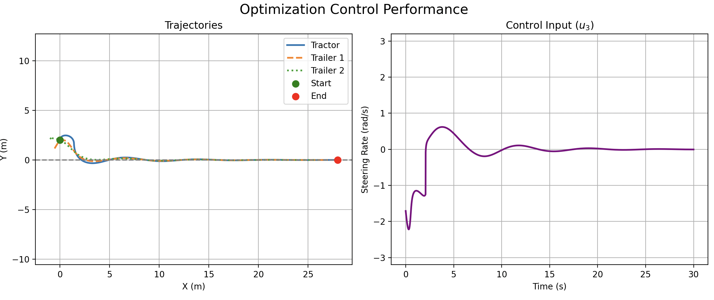
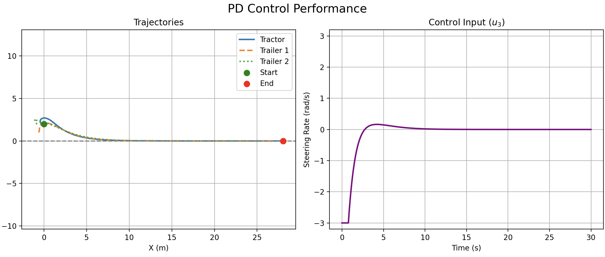
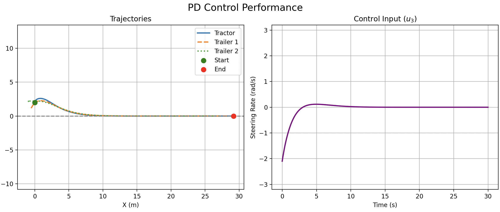

## 4. Examples

### 4.1 The 2-Trailer System

Given a 2-trailer system, the dynamics can be described as:

$$
\begin{bmatrix} \dot{x}_1 \\ \dot{x}_2 \\ \dot{x}_3 \\ \dot{x}_4 \\ \dot{x}_5 \end{bmatrix} = \underbrace{\begin{bmatrix} V \cos x_3 \\ V \sin x_3 \\ 0 \\ \frac{V}{L_1} \sin(x_3 - x_4) \\ \frac{V}{L_2} \cos(x_3 - x_4) \sin(x_4 - x_5) \end{bmatrix}}_{g_0(x)} + \underbrace{\begin{bmatrix} 0 \\ 0 \\ 1 \\ 0 \\ 0 \end{bmatrix}}_{g_1(x)} u
$$

Where $V$ is the constant forward speed, $L_1$ and $L_2$ are the lengths of the first and second trailers, respectively, and $x = [x_1, x_2, x_3, x_4, x_5]^T = [p_x, p_y, \theta_0, \theta_1, \theta_2]^T$ represents the position and orientation of the vehicle and its trailers. The control input $u$ is the angular velocity of the vehicle ($u = u_3$).

#### 4.1.1 Coupleness Matrix for the 2-Trailer System

Firstly and obviously:

$$
[g_0, g_1] = - \frac{\partial g_0}{\partial x_3} = \begin{bmatrix} V \sin x_3 \\ -V \cos x_3 \\ 0 \\ -\frac{V}{L_1} \cos(x_3 - x_4) \\ \frac{V}{L_2} \sin(x_3 - x_4) \sin(x_4 - x_5) \end{bmatrix}
$$

Notice that:

$$
\mathcal{C}_{53} = \left( \left. \frac{\partial f_5}{\partial x_3} \right|_{x_0} \cdot \frac{1}{\dot{x}_3} \right) (\Delta x_3) + \frac{1}{6} [g_0, [g_0, g_1]]_5 \cdot (\Delta x_3)^2 + \ldots \\
\implies \frac{\partial f_5}{\partial x_3} = -\frac{V}{L_2} \sin(x_3 - x_4) \sin(x_4 - x_5)
$$

This captures the nonlinear coupling between the vehicle's heading and the second trailer's orientation. 

In a similar manner, we calculate the whole matrix $\mathcal{C}$. For brevity, focusing primarily on the 3rd column (since $u$ only directly acts on $x_3$):

First order:

$$
\mathcal{C}^{(1)} = \begin{bmatrix}
1 & 0 & -\frac{V \sin x_3}{u} & 0 & 0 \\
0 & 1 & \frac{V \cos x_3}{u} & 0 & 0 \\
0 & 0 & 1 & 0 & 0 \\
0 & 0 & \frac{V \cos(x_3 - x_4)}{L_1 u} & 1 & 0 \\
0 & 0 & -\frac{V \sin(x_3 - x_4) \sin(x_4 - x_5)}{L_2 u} & \frac{L_1 \cos(x_3 - 2x_4 + x_5)}{L_2 \sin(x_3 - x_4)} & 1
\end{bmatrix}
$$

Second order:

$$
[g_0, [g_0, g_1]] = \begin{bmatrix} 0 \\ 0 \\ 0 \\ -\frac{V^2}{L_1^2} \\ \frac{V^2}{L_1 L_2} \cos(x_4 - x_5) \end{bmatrix}
$$

In total, the coupleness matrix column for the actuated state $x_3$ in the 2-trailer system is:

$$
\begin{bmatrix} \mathcal{C}_{13} \\ \mathcal{C}_{23} \\ \mathcal{C}_{33} \\ \mathcal{C}_{43} \\ \mathcal{C}_{53} \end{bmatrix} = 
\underbrace{\begin{bmatrix} 
-\frac{V \sin x_3}{u} \Delta x_3 \\ 
\frac{V \cos x_3}{u} \Delta x_3 \\ 
0 \\
\frac{V \cos(x_3 - x_4)}{L_1 u} \Delta x_3 \\
-\frac{V \sin(x_3 - x_4) \sin(x_4 - x_5)}{L_2 u} \Delta x_3
\end{bmatrix}}_{C_{p,\cdot 3}} 
+ \underbrace{\begin{bmatrix} 
0 \\ 
0 \\ 
1 \\
-\frac{V^2}{6 L_1^2} (\Delta x_3)^2 \\
\frac{V^2 \cos(x_4 - x_5)}{6 L_1 L_2} (\Delta x_3)^2 
\end{bmatrix}}_{C_{q,\cdot 3}} + \underbrace{\ldots}_{\text{Higher Order}}
$$

By definition, separating terms with $1/u$ into $\mathcal{C}_p$ and terms independent of $1/u$ into $\mathcal{C}_q$, we extract $P$ from $\mathcal{C}_p$ ($P_{ij} = \mathcal{C}_{p,ij} \cdot u_j$):

$$
P = \begin{bmatrix} 
0 & 0 & -V \sin x_3 \Delta x_3 & 0 & 0 \\ 
0 & 0 & V \cos x_3 \Delta x_3 & 0 & 0 \\ 
0 & 0 & 0 & 0 & 0 \\
0 & 0 & \frac{V}{L_1} \cos(x_3 - x_4) \Delta x_3 & 0 & 0 \\
0 & 0 & -\frac{V}{L_2} \sin(x_3 - x_4) \sin(x_4 - x_5) \Delta x_3 & 0 & 0
\end{bmatrix}
$$

When evaluating the control influence, $\mathcal{C}_p G u$ simplifies to the constant drift terms $P \mathbf{1}_n$, while $\mathcal{C}_q G u$ isolates the components dependent on $u$:

$$
\mathcal{C}_p G u = P \cdot \mathbf{1}_n = \begin{bmatrix} 
-V \sin x_3 \Delta x_3 \\ 
V \cos x_3 \Delta x_3 \\ 
0 \\
\frac{V}{L_1} \cos(x_3 - x_4) \Delta x_3 \\
-\frac{V}{L_2} \sin(x_3 - x_4) \sin(x_4 - x_5) \Delta x_3
\end{bmatrix}
$$

$$
\mathcal{C}_q G u = \begin{bmatrix} 
0 \\ 
0 \\ 
u_3 \\
-\frac{V^2}{6 L_1^2} (\Delta x_3)^2 \cdot u_3 \\
\frac{V^2 \cos(x_4 - x_5)}{6 L_1 L_2} (\Delta x_3)^2 \cdot u_3
\end{bmatrix}$$
Because $m < n$ (underactuated), we can project the control input to actively minimize the error across selected dimensions simultaneously. Suppose we prioritize the tractor's position ($x_1, x_2$) and the heading angles of both trailers ($x_4, x_5$). We set the system equation to match the desired error decay $-k \cdot \vec{e}_{error}$:

$$
\Delta x_{selected} = (\mathcal{C}_p G u)_{selected} + (\mathcal{C}_q G u)_{selected} = -k \cdot \vec{e}_{error, selected}
$$

Rearranging to isolate the terms containing our control input $u_3$:

$$
(\mathcal{C}_q G u)_{selected} = -k \cdot \vec{e}_{error, selected} - P_{selected}\mathbf{1}_n
$$

$$
\begin{bmatrix} 
0 \\ 
0 \\ 
-\frac{V^2}{6 L_1^2} (\Delta x_3)^2 \cdot u_3 \\
\frac{V^2 \cos(x_4 - x_5)}{6 L_1 L_2} (\Delta x_3)^2 \cdot u_3
\end{bmatrix}
= 
\begin{bmatrix}
-k e_1 + V \sin(x_3) \Delta x_3 \\ 
-k e_2 - V \cos(x_3) \Delta x_3 \\ 
-k e_4 - \frac{V}{L_1} \cos(x_3 - x_4) \Delta x_3 \\
-k e_5 + \frac{V}{L_2} \sin(x_3 - x_4) \sin(x_4 - x_5) \Delta x_3
\end{bmatrix}
$$

Substituting $\Delta x_3 = u_3 \Delta t$ (with $\Delta t$ set to 1 for simplicity), we can solve for $u_3$:

$$
\begin{bmatrix} 
0 \\ 
0 \\ 
-\frac{V^2 \Delta t^2}{6 L_1^2} u_3^3 \\
\frac{V^2 \Delta t^2 \cos(x_4 - x_5)}{6 L_1 L_2} u_3^3
\end{bmatrix}
\approx 
\begin{bmatrix}
-e_1 + V \sin(x_3) u_3 \Delta t \\ 
-e_2 - V \cos(x_3) u_3 \Delta t \\ 
-e_4 - \frac{V}{L_1} \cos(x_3 - x_4) u_3 \Delta t \\
-e_5 + \frac{V}{L_2} \sin(x_3 - x_4) \sin(x_4 - x_5) u_3 \Delta t
\end{bmatrix} \\
\implies \begin{bmatrix} 
0 \\ 
0 \\ 
-\frac{V^2}{6 L_1^2} u_3^3 \\
\frac{V^2\cos(x_4 - x_5)}{6 L_1 L_2} u_3^3
\end{bmatrix}
\approx 
\begin{bmatrix}
-e_1 + V \sin(x_3) u_3 \\ 
-e_2 - V \cos(x_3) u_3 \\ 
-e_4 - \frac{V}{L_1} \cos(x_3 - x_4) u_3 \\
-e_5 + \frac{V}{L_2} \sin(x_3 - x_4) \sin(x_4 - x_5) u_3
\end{bmatrix} \\
$$

Move error terms to the left-hand side:

$$
\begin{bmatrix}
e_1 \\
e_2 \\
e_4 \\
e_5
\end{bmatrix}
\approx
\begin{bmatrix}
V \sin(x_3) u_3 \\
-V \cos(x_3) u_3 \\
\frac{V^2}{6 L_1^2} u_3^3 - \frac{V}{L_1} \cos(x_3 - x_4) u_3 \\
-\frac{V^2 \cos(x_4 - x_5)}{6 L_1 L_2} u_3^3 + \frac{V}{L_2} \sin(x_3 - x_4) \sin(x_4 - x_5) u_3
\end{bmatrix}
$$

We still optimize $u_3$ to minimize the error vector by using a least-squares approach.

With python script [trailer.py](src/Trailer/trailer.py) the result is simulated:

It is not perfectly critically damped because we only have second order terms in the coupleness matrix, but it is still a good result. Compared to PD:

PD control has the damper term in D, so the curve moves smoother, but coupleness control has better energy efficiency especially at initial stage, because the higher order terms in the coupleness matrix can provide a more accurate control input to reduce the error vector, also the $sin$ and $cos$ terms in the coupleness matrix can provide a more accurate control input to reduce the error vector. 

Actually, a finely tuned PD could achieve similar energy efficiency, but it will result in longer response time. See as follows:

