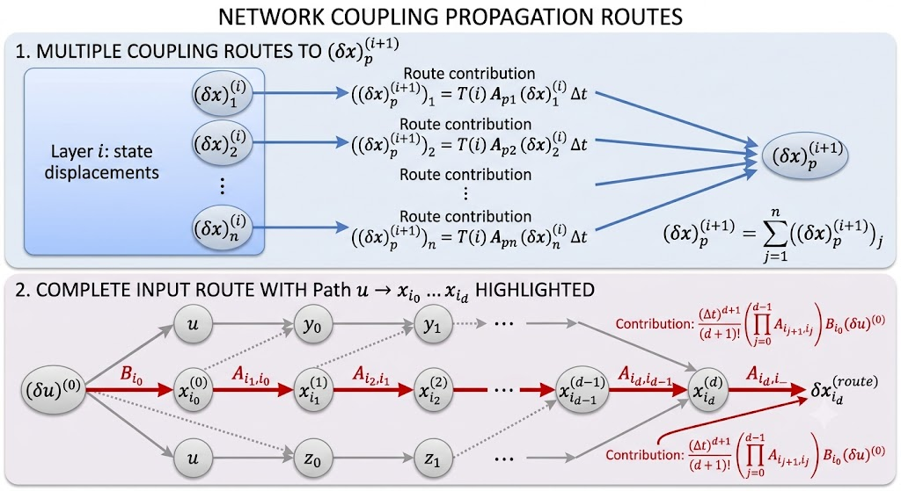

# Route-Based Control Strategy — Approach 3

Previously, after several trials and errors, I considered defining a route-based control strategy that better captures the original ideas of coupleness and separation of concerns in controller design.

[TOC]

## 1. Core concepts

### 1.1 Input layers

For the nonlinear system

$$
\dot{x}=f(x,u) = g_0(x) + g_1(x)u, x\in \mathbb{R}^n, u\in \mathbb{R}^m
$$

The core idea is to **view $\delta x_i$ as an input**.

Previously, the "Coupleness" Controller (that works out successfully), intrinsically do the following:

1. Propagate the time for $\delta x_j$ to occur
2. Plug the time into the expression of interfered state change tendency of $\delta x_j$ on $\delta x_i$.
3. Approximate direct influence of $u$ on each $\delta x_j$ and view them independently.

This gives a expression of:

$$
\begin{aligned}
\frac{\Delta x_j}{\Delta x_i} \approx& \left( \left. \frac{\partial f_j}{\partial x_i} \right|_{x_0} \right) \cdot \frac{\Delta x_i}{\dot{x}_i} \\
& + \frac{1}{2}\left(  \left( \left. \frac{\partial^2 f_j}{\partial x_i^2} \right|_{x_0} \right) - \left( \left. \frac{\partial f_j}{\partial x_i} \right|_{x_0} \right) \cdot \frac{\ddot{x}_i}{\dot{x}_i^2}  \right) \frac{(\Delta x_i)^2}{\dot{x}_i} \\
& + \mathcal O(\Delta x_i^3) \\
=& \int_{x_0}^{x_0 + \Delta x_i} \frac{1}{\dot{x}_i} \frac{\partial f_j}{\partial x_i} dx_i
\end{aligned}
$$

Here $\frac{\partial f_j}{\partial x_i}$ is the instantaneous coupleness between $x_i$ and $x_j$, while $\frac{1}{\dot{x}_i}$ is the time propagation factor. The integral form captures the finite-time effect of $\delta x_i$ on $\delta x_j$.

The term $\frac{1}{\dot{x}_i}$ is function as a compensation for the unit, because $f$ will output the derivative.

In this aspect we view the system as a overlap as several layers of input cause by coupleness:

> **Definition 1.1.1**
Given a input $u$, it will cause a direct change of $(\delta \dot x)^{[0]}$, which is the first layer of input. Define:
$$
(\delta \dot x)^{[0]} = \frac{\partial f}{\partial u} \delta u
$$
To make the layers overlappable, we need the expression of $\delta x$ instead of $\delta \dot x$. So we have:
$$
\int_t^{t+\Delta t}
\frac{\partial f}{\partial u}
\bigl(x(\tau),u(\tau)\bigr)
\delta u(\tau) d\tau.
$$
We assume $u$ is constant over a short time interval, which is usually the case in control design implementation. So we have:
$$
\delta u(\tau)\approx\delta u,
$$
In my philosoply, the direct layer of input is the one that caused $\delta x$ to move uniformly as follows (is also a the first term of Taylor expansion):
$$
(\int_t^{t+\Delta t}\frac{\partial f}{\partial u}
\bigl(x(\tau),u(\tau)\bigr) d\tau )^{[1]}
= \left.
\frac{\partial f}{\partial u}
\right|_{x(t),u(t)} \Delta t
$$
Which gives 
$$
\boxed{
(\delta x)^{[0]}
= \frac{\partial f}{\partial u}
\delta u\Delta t = B \delta u \Delta t
}
$$

The mathmatical support for this is from the Taylor expansion of $f$ with respect to $u$:
$$
f(x,u+\delta u) = f(x,u) + \frac{\partial f}{\partial u} \delta u + \mathcal O(\delta u^2)
$$
For the second layer of input, we need more careful definition. 

>**Definition 1.1.2**
Given a input $u$, it will cause a direct change of $(\delta \dot x)^{[1]}$, which is the first layer of input. Define:
$$
(\delta \dot x)^{[k+1]} = \frac{\partial f}{\partial x} (\delta x)^{[k]}
$$
Similarly, we can have the expression of $\delta x$ instead of $\delta \dot x$. So we have:
$$
(\delta x)^{[k+1]} = T(k)\frac{\partial f}{\partial x} (\delta x)^{[k]} \Delta t = T(k)A (\delta x)^{[k]} \Delta t
$$
Here $T(k) = \frac{1}{k+2}$ is the time propagation factor for the $k$-th layer of input. Because the higher layer of input will have lower impact on the system. Full expression of $\delta x^{[k]}$ is:
$$
(\delta x)^{[k]} = \left( \prod_{i=0}^{k-1} T(i) A \right) (\delta x)^{[0]} \Delta t \\
= \frac{1}{(k+1)!} A^k (\delta x)^{[0]} \Delta t \\
= \frac{1}{(k+1)!} A^k B \delta u \Delta t
$$

From these definitions, we naturally have the following expression of $\delta x$ caused by $u$:

$$
\delta x = \sum_{k=0}^{\infty} (\delta x)^{[k]}
$$

### 1.2 Input route

The reason for the above definition is that we can view interference of different state variables separately. For example:

$$
(\delta x)^{[i+1]}_p = T(i+1)\sum_{j=1}^{n} (\delta x)^{[i]}_{p,j} \Delta t
$$ 

This term will indicate the exact portion of $\delta x^{[i]}$ that will cause the change of $\delta x^{[i+1]}_p$. This is the route of input from $x_j$ to $x_p$.

And specifically, we can also take out:

$$
((\delta x)^{[i+1]}_p)_{k \text{ contribution}} = T(i+1)A_{p,k}(\delta x)^{[i]}_{p,k} \Delta t
$$

And this will give us an exact route of input: $x_k \to x_p$.

Even better, a full route of input with $u \to x_{i_1} \to \ldots \to x_{i_d}$ can be defined as:

$$
\delta x_{i_d}^{(\text{route})} = \frac{(\Delta t)^{d+1}}{(d+1)!} A_{i_d i_{d-1}} A_{i_{d-1}i_{d-2}} \cdots A_{i_1i_0} B_{i_0} \delta u \\
= \frac{(\Delta t)^{d+1}}{(d+1)!} \left( \prod_{j=0}^{d-1} A_{i_{j+1},i_j} \right) B_{i_0} \delta u
$$

To sum up:

### 1.3 Route Relation measurement

Now that given a expression of a route of input:

$$
\delta x_{i_d}^{(\text{route})} = \frac{(\Delta t)^{d+1}}{(d+1)!} \left( \prod_{j=0}^{d-1} A_{i_{j+1},i_j} \right) B_{i_0} \delta u \\
or \\
\delta x_{i_d}^{(\text{route})} = \frac{(\Delta t)^{d}}{(d+1)!} \left( \prod_{j=0}^{d-1} A_{i_{j+1},i_j} \right) (x_{i_0}^{(\text{route})})^{[0]}
$$

To simplify the notation, we can use the graph theory method:

> **Definition 1.3.1**
$$
x_j \xrightarrow{A_{ij}} x_i,
$$
Is the coupleness edge from $x_j$ to $x_i$. Notice that it only depends on the index of the variable not the number of layers of input.

Naturally, a direct input-to-state edge will be written as

$$
u \xrightarrow{B_i} x_i,
$$

> **Definition 1.3.2**
The symbol
$$
x_j \rightsquigarrow x_i
$$
indicates that at least one directed route exists from \(x_j\) to \(x_i\).

#### Input route definition

Any route from the input to a state variable can be defined similar to a route \(\pi\) as

$$
\pi:
\quad
u
\xrightarrow{B_{i_0}}
x_{i_0}
\xrightarrow{A_{i_1i_0}}
x_{i_1}
\xrightarrow{A_{i_2i_1}}
\cdots
\xrightarrow{A_{i_di_{d-1}}}
x_{i_d}
$$

The number of edges in this route is

$$
|\pi|=d+1
$$

> **Definition 1.3.3**
For a route $\pi: x_{i_0} \rightsquigarrow x_{i_d} $, define the instantaneous route weight as
$$
w(\pi)
=
\left(
\prod_{j=0}^{d-1}
A_{i_{j+1},i_j}
\right)
B_{i_0}
$$
Notice $d-1 \geq 0$ for any route with at least one edge.

If expended, we have

$$
w(\pi)
=
A_{i_di_{d-1}}
A_{i_{d-1}i_{d-2}}
\cdots
A_{i_1i_0}
B_{i_0}
$$

>**Definition 1.3.4**
Define the finite-time route coupleness over the interval \(\Delta t\) as
$$
\boxed{
\mathfrak C_{\Delta t}(\pi)
=
\frac{(\Delta t)^{|\pi|}}{|\pi|!}
w(\pi)
}
$$

Since \(|\pi|=d+1\), this can be written as

$$
\boxed{
\mathfrak C_{\Delta t}(\pi)
=
\frac{(\Delta t)^{d+1}}{(d+1)!}
\left(
\prod_{j=0}^{d-1}
A_{i_{j+1},i_j}
\right)
B_{i_0}
}
$$

The state displacement generated through route \(\pi\) is

$$
\delta x_{i_d}^{(\pi)}
=
\mathfrak C_{\Delta t}(\pi)\,\delta u
$$

Expanding the definition gives

$$
\delta x_{i_d}^{(\pi)}
=
\frac{(\Delta t)^{d+1}}{(d+1)!}
\left(
\prod_{j=0}^{d-1}
A_{i_{j+1},i_j}
\right)
B_{i_0}\delta u
$$

A route \(\pi\) is called a **direct route** if \(|\pi|=1\), i.e., it consists of a single edge. Otherwise, it is called an **indirect route**.

#### Expression using the direct-layer displacement

Since we already have the direct-layer displacement of \(x_{i_0}\) as

$$
(\delta x_{i_0})^{[0]}
=
\Delta t\,B_{i_0}\delta u
$$

Then the same route contribution can be written as

$$
\boxed{
\delta x_{i_d}^{(\pi)}
=
\frac{(\Delta t)^d}{(d+1)!}
\left(
\prod_{j=0}^{d-1}
A_{i_{j+1},i_j}
\right)
(\delta x_{i_0})^{[0]}
}
$$

### Set of routes

Define the set of all routes from \(u\) to \(x_i\) as

$$
\Pi(x_{i_a},x_{i_b})
=
\left\{
\pi\mid x_{i_a}\rightsquigarrow x_{i_b}
\right\}.
$$

>**Definition 1.3.5**
Define the total finite-time coupleness from \(u\) to \(x_i\) as
$$
\mathfrak C_{i ｜ u}(\Delta t)
=
\sum_{\pi\in\Pi(u,x_i)}
\mathfrak C_{\Delta t}(\pi)
$$

>**Definition 1.3.6**
Define the total finite-time coupleness from \(x_{i_a}\) to \(x_{i_b}\) under \(u\) as
$$
\mathfrak C_{i_b\leftarrow i_a ｜ u}(\Delta t)
=
\frac{\sum_{\pi\in\Pi(u,x_{i_b})}
\mathfrak C_{\Delta t}(\pi)}{\sum_{\pi\in\Pi(u,x_{i_a})}
\mathfrak C_{\Delta t}(\pi)}
$$
Note this requires that \(\sum_{\pi\in\Pi(u,x_{i_a})}
\mathfrak C_{\Delta t}(\pi)\neq 0\), meaning that the route $\Pi(u,x_{i_a})$ is non-empty and $u$ will have a non-zero influence on $x_{i_a}$.
Also note that it is not equivalent to and we cannot define it as:
$$
\mathfrak C_{i_b\leftarrow i_a ｜ u}(\Delta t)
=
\sum_{\pi\in\Pi(x_{i_a},x_{i_b})}
\mathfrak C_{\Delta t}(\pi)
$$
Because the route from \(x_{i_a}\) to \(x_{i_b}\) may not be the same as the route from \(u\) to \(x_{i_b}\). The former is a subset of the latter, and the latter may contain other routes that do not pass through \(x_{i_a}\), so the coefficient inside $\mathfrak C$ will be different.

Therefore, the total input-induced displacement between \(x_{i_a}\) and \(x_{i_b}\) is

$$
\delta x_{i_b}
=
\mathfrak C_{i_b\leftarrow i_a ｜ u}(\Delta t)\,\delta x_{i_a}
$$

Naturally the total input-induced displacement from \(u\) to \(x_i\) is

$$
\delta x_i
=
\mathfrak C_{i\leftarrow u | u }(\Delta t)\,\delta u = \mathfrak C_{i | u }(\Delta t)\,\delta u 
$$

Equivalently,

$$
\delta x_i
=
\sum_{\pi\in\Pi(u,x_i)}
\delta x_i^{(\pi)}.
$$

From the here we finish the definition of route-based coupleness and the expression of input-induced displacement. From now on we will use:

$$
\mathfrak C_i = \mathfrak C_{i | u}(\Delta t)
$$

And use 

$$
\mathfrak C(\pi) = \mathfrak C_{\Delta t}(\pi)
$$